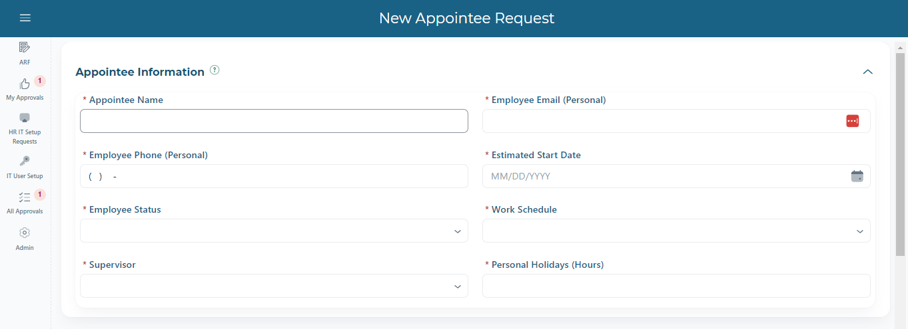

```mdx-code-block
import Tabs from '@theme/Tabs';
import TabItem from '@theme/TabItem';
```

# Entering Requests

## Start a New Form
From the application homepage, click the New Request Button:


The form will open and is ready for input. 

## Form Sections

The form is comprised of 3 main sections:
    - Appointee Details
    - Position Details
    - Employee Setup


<Tabs className="formfield-tabs">
  <TabItem value="Appointee Details"></TabItem>
  <TabItem value="Position Details"></TabItem>
  <TabItem value="Employee Setup"></TabItem>
</Tabs>

:::tip
To save a form without submitting, Appointee Name and Position are required.  All other fields may remain blank.
:::

### Entering Appointee Details

If the supervisor drop-down does not have the supervisor that is needed for the position, please contact IT to have the employee setup as a supervisor in the system.

### Selecting a Position

The form is designed to simplify data entry.  Instead of manually inputting position details, the position is selected from a dialog.  

To select a position, click the select position button:


A dialog will appear:


Positions that are unavailable are italicized in red, and are not selectable. There are filters at the top of the page for department, bargaining unit, and salary grade, as well as a toggle to only show available positions.

Once a position is selected, the selected position is displayed in the Selected Position text box below the table, along with the Position GL string/Allocations.  Before continuing, a salary step must be selected:


After selecting a salary step, the annual/monthly/hourly rate information will automatically populate, and the save button at the top of the screen will no longer be disabled:


Click save, and all of the selected information will transfer to the request form.


### Employee Setup

The employee setup fields are just text fields.  Specific requests can be noted, or instructions to copy the setup of an existing employee.


## Form Submission

To submit the form, it must first be saved as a draft. 


Once the draft is saved, a new field will appear to upload the NeoGov Requisition PDF:


When you are ready to submit, validate the form first:


If the form is valid, the Submit Request button will no longer be disabled and the form can be submitted. 
