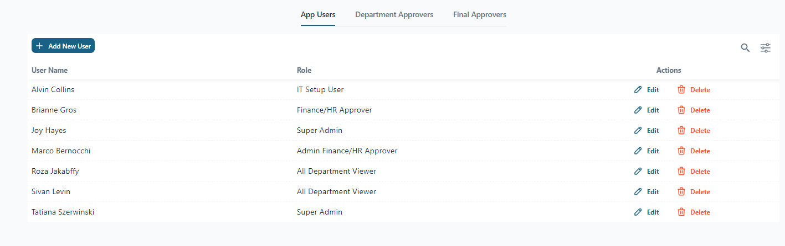
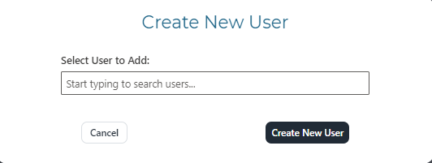
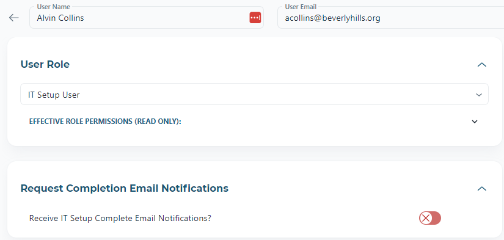
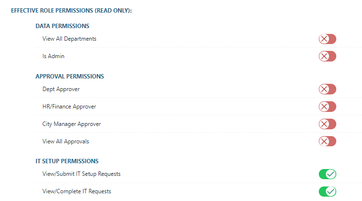
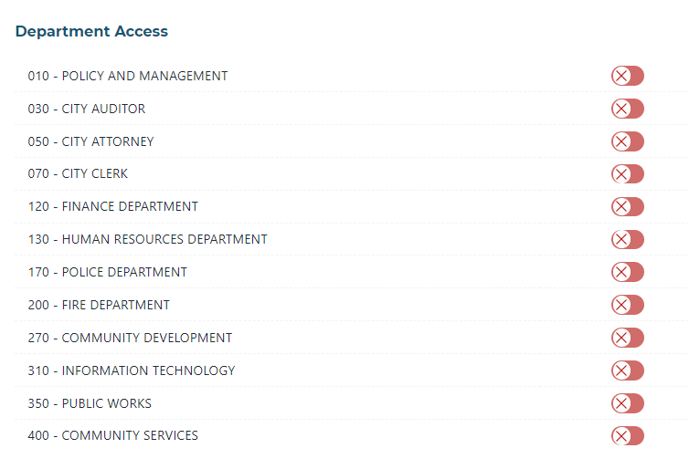
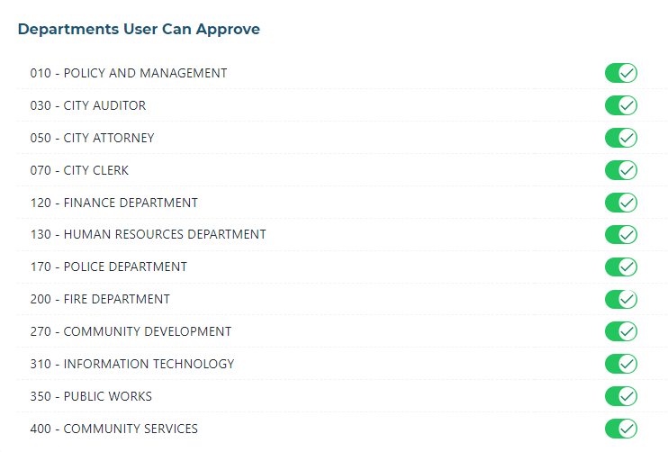
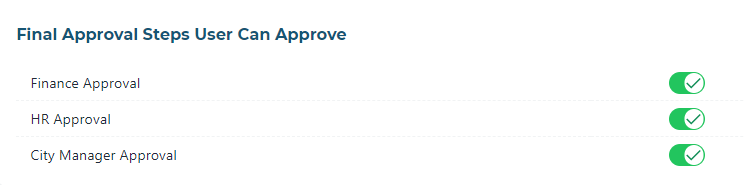

# Administering Users

## User Interface

There are three tabs in the Admin area:  App Users, Department Approvers and Final Approvers.

## Add a User

To add a user, click Add New User on the toolbar from the main Admin screen.

Type the user's name in the input box, and select the correct user from the dropdown that appears as you search.

Click Create New User.

The new user screen will appear to allow for user permission configuration.

## User Permissions

By default, all users have a minimal Basic User role when they are created. 

To select a new role, select a role from the dropdown. 

To view a summary of role permissions, expand the Effective Role Permissions section: 

If the user does not have View-All Department permissions, select the relevant departments that the user should have access to:

## Modify User Permissions

## Remove a User

