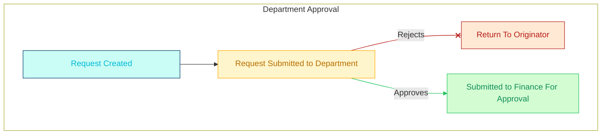
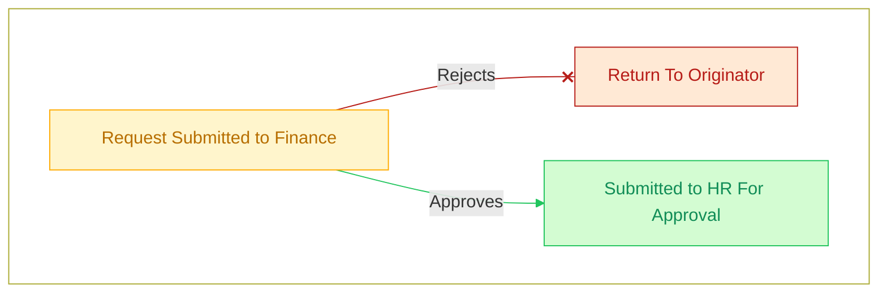
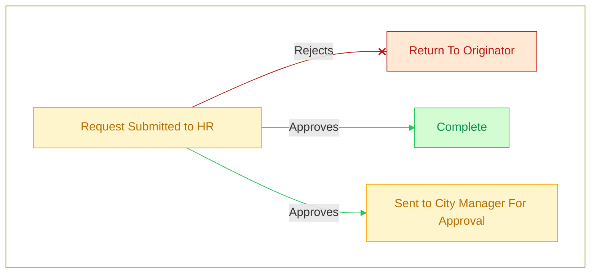
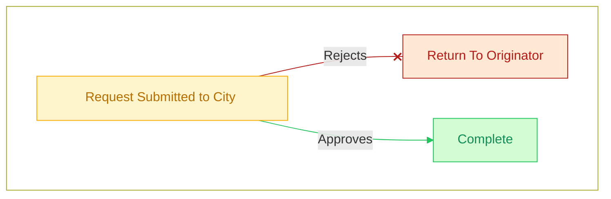

# Overview


## Appointment Request Process

### Form Submission & Department Approval


### Finance Approval


### HR Approval


### City Manager Approval





## User Interface

Generate a new Docusaurus site using the **classic template**.

The classic template will automatically be added to your project after you run the command:

```bash
npm init docusaurus@latest my-website classic
```

You can type this command into Command Prompt, Powershell, Terminal, or any other integrated terminal of your code editor.

The command also installs all necessary dependencies you need to run Docusaurus.

