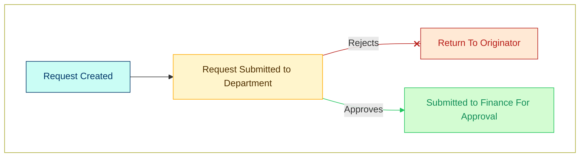
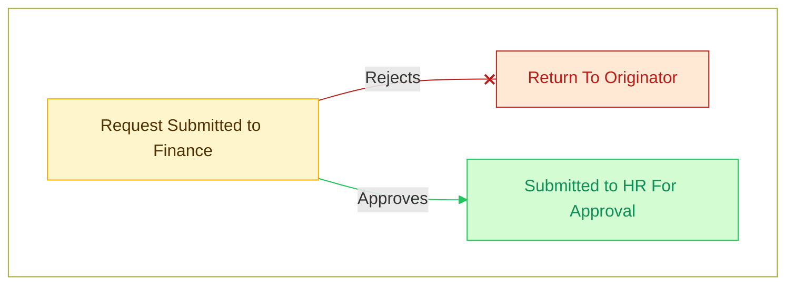
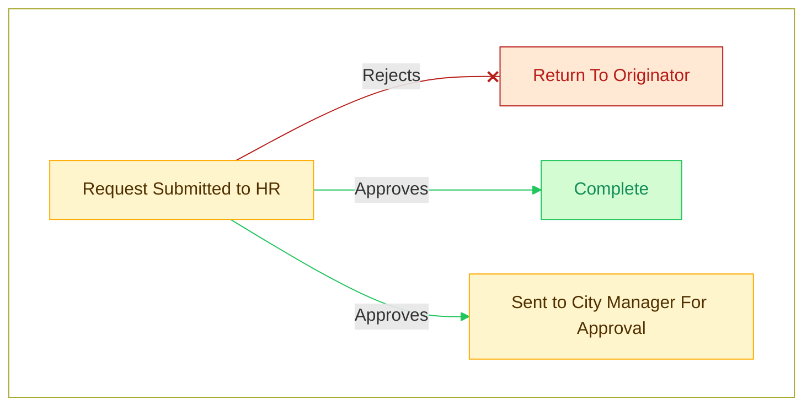
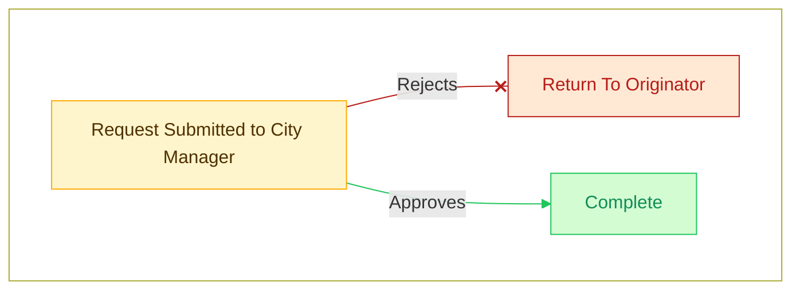

# Overview

## User Interface

The homepage for the Appointment Request form will display a list of existing form entries, with a navigation pane on the left, where all areas of the application are accessible.

The navigation pane contents will vary based on the users access.

## Form Process

When a form is created and submitted, it goes through several approval steps.

### Department Approval

Once the department approval is complete, the person who who submitted the request will be notified via email of the outcome.

### Finance Approval

Once the finance approval is complete, the person who who submitted the request will be notified via email of the outcome.

### HR Approval

Once the HR approval is complete, the person who who submitted the request will be notified via email of the outcome.

### City Manager Approval

Once the City Manager approval is complete (if HR sent the request to the City Manager), the person who who submitted the request will be notified via email of the outcome.

## IT Setup

Once the form has completed all of the approval steps, it is sent to IT for user setup. Once completed, the person who submitted the appointment request as well as HR will be notified by email.